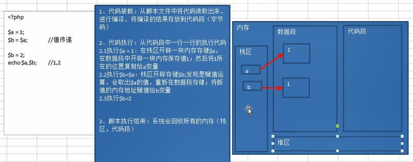

### 变量
1，变量是用来储存数据的。
2，变量是存在名字的。
3，变量是通过名字来访问数据的。
4，变量的数据是可变的。

定义变量：php中的所有变量都使用$符号。在php中不需要任何关键字定义变量（赋值）。

### 变量名
1，在php中变量名字必须以“$"符号开头。
2，由字母，数字和下划线“_”构成，但是不能以数字开头。
3，在php中可以使用中文变量，但是不建议使用。

### 预定义变量
提前定义的变量，系统定义的变量，储存许多需要用到的数据（预定义变量都是数组。）
$_GET : 获取所有表单以get方式提交的数据。
$_POST : post提交的数据都会保存在此。
$_REQUSET :   get和post提交的数据都会保存。
$GLOBALS :  php中所有的全局变量。
$_SERVER : 服务器信息。
$_SESSION :session 会话数据。
$_COOKIE :  cookie 会话数据。
$_ENV : 环境信息。
$_FILES : 用户上传的数据。

### 可变变量
如果一个变量保存的值刚好是另一个变量的名字，那么可以直接通过访问一个变量得到另一个变量的值，在变量前面多加一个$符号。
$a = "b";
$b = "bb";

$$a 的值 为 “bb"。

### 变量传值
将一个变量赋值给另外一个变量。
变量传值一共有两种方式：值传递，引用传递。 

值传递：$a = 1; $b = $a;
			 
			 将变量保存的值复制一份给另外一个变量保存（连个变量没有关系。）
			 
引用传递：$新变量 = &$老变量 （&：地址符号）
				
				将变量保存的值所在的内存地址，传递给另一个变量：两个变量指向统一内存空间（两个变量是同一个值）。

在内存中，通常有以下几个分区。
栈区：程序可以操作的内存部分（不存数据，运行程序代码），少但是快。
代码段：存储程序的内存部分（不执行）。
数据段：存储普通数据（全局区和静态区）。
堆区：存储复杂数据，大但是效率较低。

## 常量
php中两种定义方式：
1，使用定义常量的函数：define（“常量名”，常量值）。
2，5.3之后：const 常量名 = 常量值；

规则：常量不需要使用“$"符号，常量的名字由字母，数字和下划线组成，不能以数字开头。常量的名字通常使用大小字母（与变量区分）。常量命名的规则比变量要松散，可以使用一些特殊字符，该方式只能使用define定义。

注意：
	1，Define和 const 定义的常量是有区别的，在于访问权限。
	2，常量定义不区分大小写，但是可以区分，通过define函数的第三个参数。

常量的使用与变量相同，不同的是常量不可以改变值。